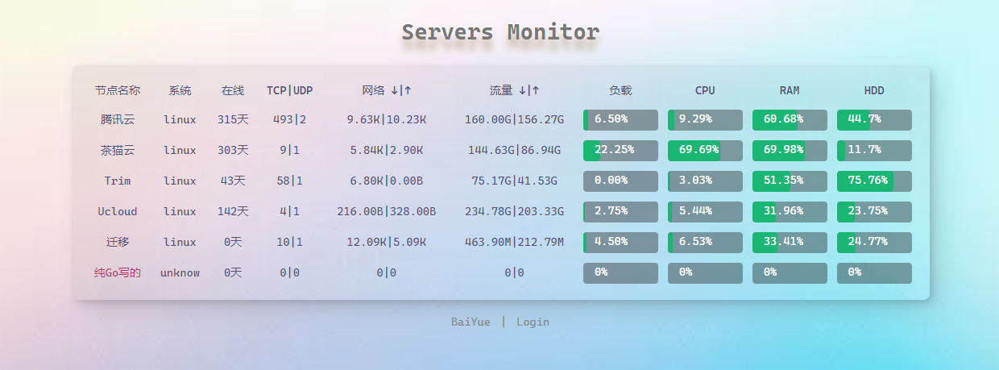
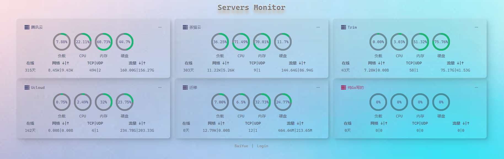
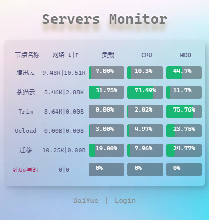
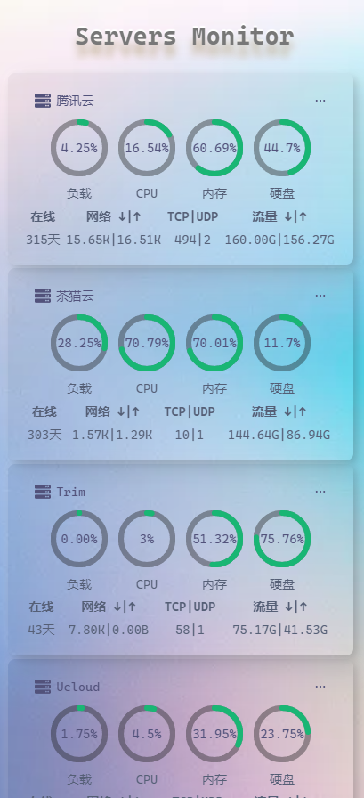
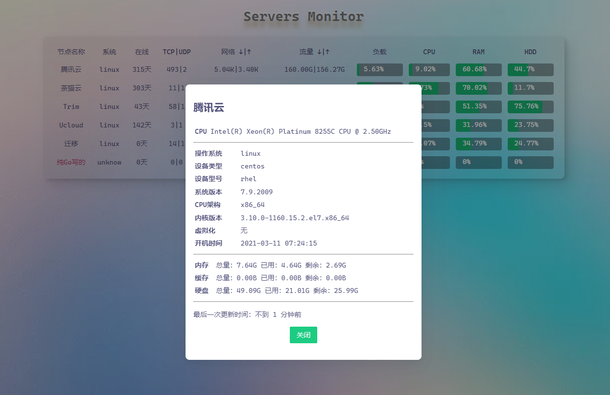

# ServersMonitor
云监控、云探针，拟物态UI设计。纯Go编写，零依赖低内存低消耗、可跨终端使用。

## 在线演示
http://119.29.25.39:3070

## 演示截图
pc端演示




移动端演示：





支持详情


后台截图(可新增、拖拽节点顺序、修改账户密码等):


节点添加后自动生成一键部署节点脚本、可一键复制后执行。告别手动参数设置。

## 特点
- 纯Go编写、零依赖低消耗
- 支持linux、windows、macos(不局限服务器)
- 自带管理界面、可新增、删除管理节点
- 自带一键部署节点命令

## 安装教程
云监控面板安装一键脚本：
```sh
待写。。。
```

节点服务器安装：
从后台管理界面列表，一键复制命令，然后在需要监控的节点上运行命令即可。

## 项目来源：

- [佰阅科技](https://tech.baiyue.one)

